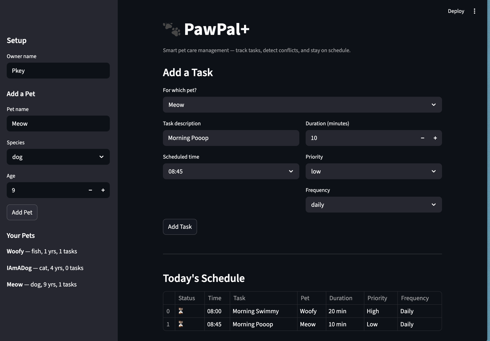

# PawPal+ 🐾

A smart pet care management system built with Python and Streamlit. PawPal+ helps pet owners track daily routines — feedings, walks, medications, and appointments — while using algorithmic logic to organize and prioritize tasks.

## Features

- **Multi-pet management** — Add and manage multiple pets with their own task lists
- **Task scheduling** — Create tasks with time, duration, priority, and frequency
- **Sorting by time** — View your daily schedule in chronological order
- **Priority sorting** — Sort tasks by urgency (high → medium → low)
- **Filter by pet** — View tasks for a specific pet
- **Conflict detection** — Get warnings when two tasks for the same pet overlap
- **Recurring tasks** — Daily and weekly tasks auto-schedule their next occurrence when completed
- **Task completion tracking** — Mark tasks done and see your progress

## Smarter Scheduling

PawPal+ goes beyond a simple to-do list with built-in scheduling intelligence:

- **Time-based sorting** uses Python's `sorted()` with a lambda key on HH:MM strings to display tasks chronologically
- **Priority ordering** maps priority levels to numeric values (high=0, medium=1, low=2) for clean sorting
- **Conflict detection** uses a dictionary keyed on `(pet_name, time)` to efficiently flag double-bookings for the same pet
- **Recurrence handling** uses `datetime.timedelta` to automatically create the next occurrence when a daily or weekly task is completed

## Architecture

The system follows a modular OOP design with four core classes:

| Class | Role |
|-------|------|
| `Task` | Dataclass representing a single activity (time, duration, priority, frequency, status) |
| `Pet` | Dataclass managing a pet's info and task list |
| `Owner` | Manages multiple pets and aggregates all tasks |
| `Scheduler` | The "brain" — sorting, filtering, conflict detection, and recurrence logic |

See `uml_final.png` for the complete class diagram.

## Setup

```bash
python -m venv .venv
source .venv/bin/activate  # Windows: .venv\Scripts\activate
pip install -r requirements.txt
```

## Usage

**Run the Streamlit app:**
```bash
streamlit run app.py
```

**Run the CLI demo:**
```bash
python main.py
```

## Testing PawPal+

Run the automated test suite:

```bash
python -m pytest tests/ -v
```

The test suite includes 20 tests covering:
- Task completion and string representation
- Pet task management (add, remove, filter pending)
- Owner pet management and task aggregation
- Sorting correctness (time and priority)
- Filtering by pet name and completion status
- Conflict detection (same pet same time vs. different pets)
- Recurrence logic (daily, weekly, one-time)
- Edge cases (empty pets, empty owner, empty scheduler)

**Confidence Level:** ⭐⭐⭐⭐ (4/5) — Core logic is well-tested. Main gap is duration-based overlap detection.

## 📸 Demo



## Tech Stack

- **Backend:** Python 3, dataclasses, datetime
- **Frontend:** Streamlit
- **Testing:** pytest
