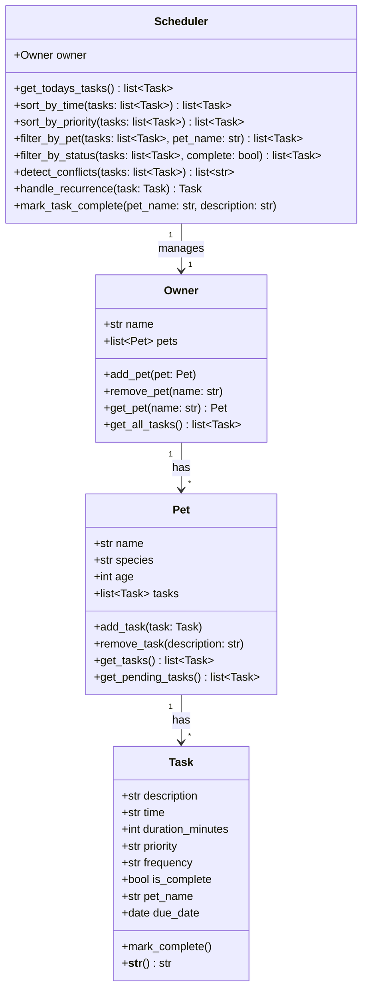

```mermaid
classDiagram
    class Task {
        +str description
        +str time
        +int duration_minutes
        +str priority
        +str frequency
        +bool is_complete
        +str pet_name
        +date due_date
        +mark_complete()
        +__str__() str
    }

    class Pet {
        +str name
        +str species
        +int age
        +list~Task~ tasks
        +add_task(task: Task)
        +remove_task(description: str)
        +get_tasks() list~Task~
        +get_pending_tasks() list~Task~
    }

    class Owner {
        +str name
        +list~Pet~ pets
        +add_pet(pet: Pet)
        +remove_pet(name: str)
        +get_pet(name: str) Pet
        +get_all_tasks() list~Task~
    }

    class Scheduler {
        +Owner owner
        +get_todays_tasks() list~Task~
        +sort_by_time(tasks: list~Task~) list~Task~
        +sort_by_priority(tasks: list~Task~) list~Task~
        +filter_by_pet(tasks: list~Task~, pet_name: str) list~Task~
        +filter_by_status(tasks: list~Task~, complete: bool) list~Task~
        +detect_conflicts(tasks: list~Task~) list~str~
        +handle_recurrence(task: Task) Task
        +mark_task_complete(pet_name: str, description: str)
    }

    Owner "1" --> "*" Pet : has
    Pet "1" --> "*" Task : has
    Scheduler "1" --> "1" Owner : manages
```
